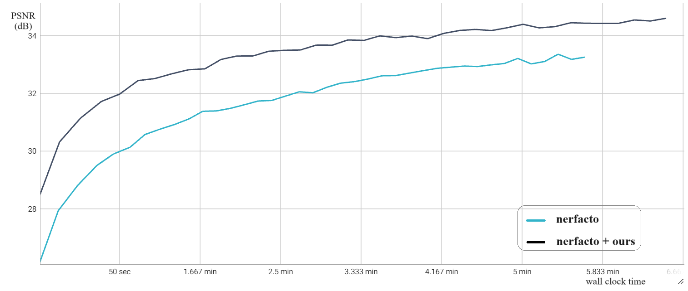

# ActRay: Online Active Ray Sampling for Radiance Fields

How can we further accelerate the trainig process of NeRF? Is there any alogrithm that can speed up all NeRF method? Here we give the answer - Actray.

**ActRay** is an **active learning based ray sampling algorithm**, which can acclerate almost all existing NeRF methods for view synthesis. We use information gained from training to calculate the sampling probability of each training ray. Due to its orthogonality with models and datasets, you can plug and play our algorithm into any methods you want!

[ActRay: Online Active Ray Sampling for Radiance Fields](https://pku-netvideo.github.io/actray)  
*Jiangkai Wu, Liming Liu, Yunpeng Tan, Quanlu Jia, Haodan Zhang, Xinggong Zhang**  
*Peking Universiy*  
SIGGRAPH Asia 2023 Conference Papers

<font size=5>[Project](https://pku-netvideo.github.io/actray) | [Paper](https://dl.acm.org/doi/10.1145/3610548.3618254)</font>

In order to reveal the universality, we implement our algorithm on [nerfstudio](https://docs.nerf.studio/), the most famous open-source platform for NeRF now. Our algorithm can actually accelerate *nerfacto* in nerfstudio up to more than 3 times on lego scene:



# Installation

Before the installation, make sure you have installed CUDA (we use cuda 11.8) and anaconda. We run the experiments on Ubuntu 20.04.

First we need to install nerfstudio. You can follow the instructions from [nerfstudio](https://docs.nerf.studio/quickstart/installation.html), or directly use the following commands:

- Initialize the anaconda environment and download torch package:
```bash
conda create --name nerfstudio -y python=3.8
conda activate nerfstudio
python -m pip install --upgrade pip
pip install torch==2.0.1+cu118 torchvision==0.15.2+cu118 --extra-index-url https://download.pytorch.org/whl/cu118
conda install -c "nvidia/label/cuda-11.8.0" cuda-toolkit
```

- Install [tiny-cuda-nn](https://github.com/NVlabs/tiny-cuda-nn/) from Nvidia:

```bash
pip install git+https://github.com/NVlabs/tiny-cuda-nn/#subdirectory=bindings/torch
```

- Then we install nerfstudio:
```bash
pip install nerfstudio
```

- Finally you need to install our method:
```bash
git clone https://github.com/pku-netvideo/actray.git
cd actray
pip install -e .
```

This completes the installation.

# Usage

Currently, we've implemented the instant-ngp, instant-ngp-bounded and nerfacto version of our algorithm. Here we use nerfacto running on lego as an example:
- If you've already had the lego scene data from NeRF Synthetic datasets, you can skip this step:

You can use command in nerfstudio,
```bash
ns-download-data blender [-h] [--save-dir PATH]
```
    
or download it directly:
```bash
wget https://drive.usercontent.google.com/download?id=18JxhpWD-4ZmuFKLzKlAw-w5PpzZxXOcG&export=download&authuser=0&confirm=t&uuid=6d1507d6-b13a-4e10-b75c-4096f57545dc&at=APZUnTWWe5S9CtjXdv6zZn-JfbgG:1702177546181
```

- Run the code (substitute PATH_TO_YOUR_LEGO_DATASET and YOUR_EXP_NAME with specific content):
```bash
ns-train method-actray-nerfacto --data PATH_TO_YOUR_LEGO_DATASET --pipeline.model.disable-scene-contraction True --pipeline.model.background-color white blender-data
```
Then you can use viewer provided by nerfstudio to watch the training process online.  

If you want to see the detailed data (like PSNR, SSIM, LPIPS, and etc), you can use this command and view them in tensorboard:
```bash
ns-train method-actray-nerfacto --vis tensorboard --steps-per-eval-batch 50 --steps-per-eval-image 200 --steps-per-eval-all-images 200 --data PATH_TO_YOUR_LEGO_DATASET --timestamp YOUR_EXP_NAME --max-num-iterations 40000 --pipeline.datamanager.camera-optimizer.mode off --pipeline.model.disable-scene-contraction True --pipeline.model.background-color white blender-data
```

Don't forget to open the tensorboard:
```bash
tensorboard --logdir outputs/lego/YOUR_EXP_NAME --port 6006
```

Now, you can see the result at localhost:6006.

# Thanks

Our project is currently implemented on [nerfstudio](https://docs.nerf.studio/quickstart/installation.html).

# Citation

    @inproceedings{10.1145/3610548.3618254,
        author = {Wu, Jiangkai and Liu, Liming and Tan, Yunpeng and Jia, Quanlu and Zhang, Haodan and Zhang, Xinggong},
        title = {ActRay: Online Active Ray Sampling for Radiance Fields},
        year = {2023},
        booktitle = {SIGGRAPH Asia 2023 Conference Papers},
        articleno = {97},
        numpages = {10},
        location = {Sydney, NSW, Australia},
        series = {SA '23}
    }

